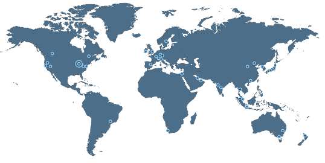

# Lecture Notes: Introduction

Copyright (C) 2024-5 by Zachary G. Ives. All Rights Reserved.

Welcome to Penn's  **NETS 2120, Scalable and Cloud Computing** course!

## What's this Course about?

At its heart, this is a course about *programming models for scalable software on the Cloud*.  Of course, there are many such models, and many ways to focus on these topics.  There are also many interrelated topics, which we will be touching on as well: a bit of engineering of software-in-the-large, a bit of Amazon Web Services as the service we will use, a bit of algorithms, etc.

As your instructor (and the author of these notes) I'll be bringing a particular perspective on the material.  I am hoping that four different perspectives will help you to make the most of the material.  I'll try to give you some perspective:

* From the point of view of a programmer and software engineer of modern scalable, data-centric, AI, and cloud solutions.
* Under-the-covers, as a researcher in cloud technologies and algorithms, particularly those handling big data and distributed machine learning.
* From an industry perspective, based on experiences as a consultant to and former CTO of cloud (big data) startups.
* From an academic CS perspective, trying to make sure you have the fundamental concepts and formalisms – not just skills – that can be applied to future tech.

We are hoping this will be a fun and enlightening journey!

#### Building upon a Simplified View of Programming
In your Introductory Programming course, you learned about "programming in the small." For simplicity, you were able to assume:

1. Your code runs on a single computer
1. A single program + libraries are running
1. Everything is within a single, trusted organization
1. Your program has exclusive use of resources
1. There is at most one user at a time

But in a sense, this is like learning to ride a bicycle with training wheels -- you build key skills, but at some point we need to also tackle the less constrained problem.  In "real" software engineering, we still seek to let you think about this simplified model wherever possible, but ultimately you have to confront some of the other complexity.

#### Software Engineering and Programming for the Cloud
In particular, in the context of the Internet, you should understand how to develop software tools, artifacts, and services that:

1. Run across many computers, whether compute clusters or distributed servers.
1. Are split into modules + libraries + services + AI agents that run across different machines.
1. Have components that span or interact with multiple organizations.
1. Share or multiplex resources, such as storage, CPU, and memory, with other programs, services, and users.
1. Support an arbitrary number of concurrent users, who might want to keep information *private* from each another.

Each of these *relaxations of constraints* brings lots of new complexity, as well as many new problems.  Importantly, we would like to develop programming models that **simplify some of the messy aspects** and make it easier to get to solutions more quickly and more reliably.

So far we have been talking about these things in a fairly abstract way. Let's try to make this more concrete.

### Examples of higher-level programming models

Consider a few examples:

1. In many settings, we will need to take our code and run it across a plethora of machines in a compute cluster.  Each machine might be doing similar operations over different subsets of our data.  This is how most "big data" tasks are solved at Google- or Facebook-scale.  Ideally, we can write programs that "scale out" automatically, without us having to think about the operations (and how to handle the failure cases).

1. Suppose we have software that runs across two devices (maybe a laptop and a server, or a smartphone and a server). Ideally we could still write code that makes function calls as if everything is on one machine. Internally, the compiler might do some work to turn this into a call to a remote function.

1. Today everyone is perhaps over-hyping AI tools, but nonetheless we might be able to simplify complex distributed programs that process messy data (text, images, etc.) by sending semi-structured *prompts* to remote Large Language Models such as GPT.

1. Sometimes we have *data structures* that need to be updated from many different devices on the Internet, in a controlled way. Ideally we can have high-level programming abstractions that let us think about basic operations (say, insert, replace, delete, lookup) and not worry about how this turns into network messages, consistency protocols, and so on.

In this course, we will consider implementations of the above abstractions, as well as some other ones.

We should note that most of the techniques we will be discussing are not "one size fits all." Many distributed and parallel programming models and tools **only work well in certain use cases**.  For example, certain tasks and algorithms require a single computer and simply don't do well in a distributed environment -- you might need a **completely different algorithm**, perhaps even one that hasn't yet been inveted!  Certain languages (such as the SQL language used in databases and Apache Spark) may sacrifice full generality ([Turing-completeness](https://en.wikipedia.org/wiki/Turing_completeness)) for other properties (e.g., scalability over big data).  Others might force certain programming styles for safety (e.g., Rust, which we will not cover here) or emphasize flexibility and simplicity over speed (e.g., Javascript, which we will cover).

### What Is the Cloud?

Pople think about the Cloud in many different ways.  Perhaps it's most useful to think about two complementary views about what it is, one from a more hardware-centric perspective and the other from a more software-centric (*service*) perspective.

#### "Computing as a service for elastically allocating resources"

The Cloud is the manifestation of *utility computing* -- an attempt to provide computing (and storage, and other) resources in a model resembling the electric power grid, city water, cable television, and other services.  In essence, as a user, you set up an account, "plug in," and draw the resources needed, on-demand.  In this model, the "utility" (say, Amazon or Oracle) invests in a "power plant" (in the cloud world, perhaps a datacenter with thousands of computers) as a shared resource, and allocates fractional resources to different customers at different times.

Given the diversity of computing (and storage, and analysis, and communciations) needs -- the Cloud might offer different configurations and services simultaneously. But you will be given the ability to request what you need, and to scale up and down in **elastic** fashion.

Back when I was a student in the early days of the Internet, every startup company had to invest in an expensive (10s of $1000s) computer as one of their first expenses.  This was to run their web site.  Why so expensive?  Because the "worst possible outcome" would be to highlighted in the news, and have your website be unavailable if you suddenly got 1 million requests.  So, we would have to provision for the maximum workload -- which almost assuredly will never come.

*Elasticity* means we can essentially *pay for what we need*, expanding and contracting our resource usage (and our expenses) accordingly.  In the modern era, you would provision a lightweight web server host, and have various mechanisms by which the server could be scaled up or replicated based on load.  In essence, you can **allocate hardware resources based on software**.

It's worth stressing that in many cases, what we get from the Cloud is not a single computer -- rather, it might be portions of the resources of many machines -- and our access to these resources might be challenging because the Internet is imperfect.

#### “A set of reusable software services”

While the Cloud provides resources, in fact these resources are all based on software *services*.  A remote machine will have at least an operating system to which you might log in; a storage service will provide a file manager or virtual storage volume; a content distribution service will copy data to different regions of the Internet so it can be accessed more efficiently by geographically distributed users.

Related to this, we need to be able to *request what we need*.  This can be surprisingly subtle: in the same way that there are differences between Java 8 and Java 18, or Mac OS Mojave vs Sonoma -- we need to be able to request software with specific configuration information, versions, and so on. Ideally, most requestable software is also *backwards-compatible* with our tools.

Much software on the cloud in fact provides functions, just as libraries and packages do in programming environments.  You can call these services remotely, pass data, and get back results.  A popular example today is OpenAI's GPT services, to which you can send *prompts* and get back results.

It's exciting to have so many *web services* at our disposal.  However, this introduces problems of finding what we want, understanding its behavior, and building applications that perform well.  For a long time, we relied on posting public documentation (say, for AWS APIs or Apache Spark) as the main way of letting programmers understand what was available; then using sample code, support forums, and venues like Stack Overflow to help people learn how to use them.

Today there is hope that some AI tools trained on the Internet (like GitHub, Bard, and CoPilot) might help with this. *However, researchers have pointed out a major risk. Most of the AI tools are trained over Stack Overflow and other support forums -- and these are taking a massive hit in usage with the advent of ChatGPT.  Without Stack Overflow, how will Bard and ChatGPT learn to do a great job with tomorrow's tools and questions?  Will we create an ossified ecosystem for tech talent and tools?*

#### Challenges of Scalable and Cloud Programming

We won't solve the problem above in this class, nor will we focus heavily on code-learning tools (rather, the class will be about that!).  We *will* spend a lot of time on some of the other challenges of cloud programming.

* Software development is easiest when it all "fits in the head of one programmer" -- as long as you understand the program, you should have minimal mis-understandings with yourself. However, at a certain scale all software requres development *teams*, or at least use of code (as libraries or services) *developed by other engineers*. Now you need to have a way of ensuring there is clarity of what everything does and expects, i.e., *interfaces* become important. Techniques for *testing*, for *coordination*, for *managing versions* all rise to the fore.

* Similarly, algorithms and tasks also become much more complex if they involve multiple machines or processors. The machines and processors must *coordinate*, they have to worry about *connection failures*. Things can get *reordered* or *delayed* and *concurrent updates to data structures* can cause many issues.

* Things can go wrong many more ways on the Internet.  When you update a variable or make a function call in a "normal" program, you don't need to worry that the CPU or the memory or the compiled code will do something wrong. But on the Internet, we can make a call to a computer that is compromised by a hacker, or that crashes; we can have the network go down, or send requests out-of-order; and so on.

* The *load* on your program may vary over time, due to a variety of factors such as the number of user requests, the complexity of the tasks, etc. We need a way to adjust to demand.

* Security, privacy, and isolation become key considerations in a multiuser environment. How do we keep each user's data private? Are we inadvertently leaking their information within an aggregated answer? Can someone determine what else is happening on our server due to timing? And so on.

#### So, What's the Class Really about?

We'd say this class is about “programming abstractions and models that simplify complex interactions,  and allow for scaling based on demand”! Along the way we'll also learn about how to use, manage, and orchestrate cloud resources; some fundamentals of distributed and parallel computing; and how AI services are becoming building blocks towards new software. And of course we hope you'll pick up many engineering skills as well!

By the end you should be able to do things like:
- Build a chatbot
- Develop a social media site
- Build progressive web apps
- Analyze really big amounts of data

### Review Questions

1. What makes *distributing the functionality a program across two computers* harder than having a single program on a single computer?

1. What is the difference between a *resource* and a *service*?

1. What do we mean by "elastic"?

1. What's an *interface*, in the context of the Internet?

## Programming for the Cloud

To address the challenges of programming for the cloud, it's worth starting by summarizing what the Cloud really is.

### The Cloud: Hardware

Amazon has 105 Availability Zones across the world, each with one or more data centers; other "hyperscale" cloud providers have similar configurations.
Internally, each stadium-sized data center has dedicated power, cooling, network.

So, it's clear that there are tremendous hardware resources available, under the right circumstances.

* How do we acquire and manage resources as we need them?

* How do we store/process petabytes of data?

We'll talk more about this over the next week or so, especially within the context of Amazon.

### The Cloud: Software

We can think of the Cloud as being built in *layers*.  These are usually characterized along several layers named similarly to the following (this specific nomenclature was proposed by TechTarget.com):
1. **Cloud clients** (browsers, mobile devices). Examples: Safari, Slack.
2. **Applications and services** (*software-as-a-service (SaaS)*, web services). Examples: GMail, Twitter/X, GPT, Google search.
3. **Platform and storage infrastructure** (app server, database, content distrib. network; *platform-as-a-service (PaaS)*). Examples: MongoDB Atlas, Dropbox, Amazon S3.
4. **Computing infrastructure** (virtualized servers, networks, disks; *infrastructure-as-a-service (IaaS)*). Examples: Amazon EC2, S3.
5. **Network** (Internet). Examples: AirPennNet, [the Internet backbone](https://en.wikipedia.org/wiki/Internet_backbone)

Now the question is how to manage and deploy such software.  Conversely, how do we build our own cloud components that can be used by others?  And, how do we build software out of these components, potentially even spanning multiple clouds?

### The Cloud Enables Data-Driven Reasoning

The core infrastructure of the Cloud was really developed to meet the needs of the biggest tech players (Google, Meta/Facebook, Twitter, Amazon, Baidu, Microsoft, Oracle, etc.).  Each of these providers found that, at scale, they could take advantage of **information about how users of their services and platforms behaved**.

While most new-generation cloud services are not likely to reach the scale of an Amazon, many of the same motivations apply.  We want to build Internet-scale platforms, and use them to take advantage of data-driven reasoning, i.e., “big data” or “AI”!  For example:

- Learn customer tastes, or predictive factors, or better UIs…
- Or: take advantage of general knowledge (large language models) plus specialized knowledge (your class notes) to answer natural language questions
- Or: take advantage of general knowledge (image embeddings) to recognize what’s in new images

### What's Hard about Cloud Programming?

So, we have a sense of what we want to do, and some of the general complexity that the Cloud brings to programming.  Let's flesh out the **challenges of cloud programming** a bit more.

**Communications over an Unreliable Internet**.  Suppose we want a new AI-driven stock trading system that responds to voice.  We need to understand that many elements of this system have to communicate over a mostly-but-not-entirely-reliable Internet.  When our app sends voice to an AI speech recognition system, or from the speech recognition system to the buy/sell system, this is implemented in a specific way that has tradeoffs.

- Each request gets split into message *packets* when it is sent across the Internet.  Small messages might fit in one or a few packets; large messages (like an audio recording) might comprise many packets.
- Packets are *routed* through multiple devices as they go between the source and destination. Each of those devices might be handling tasks for many other users -- so it can become a bottleneck, or crash.  The Internet will route "around" such issues, but as a result, packets **might arrive out of order**.  Or they can be **dropped**.  After a certain delay, we will generally resend messages (assuming they were dropped), and sometimes this means they can **get duplicated**.
- Of course, we tend to build applications in which we assume all of the components of our software are connected through the Internet.  Yet, at times someone cuts an undersea cable, or runs a backhoe through fiber, or a hacker compromises a critical part of the network.  Thus, it's possible we will **not have connectivity** for a significant period of time.  Now, what do we do?

**Establishing the Right Layers and Protocols**.
Software is complex -- even more so when it needs to work for decades, and interoperate with many other aspects.  There are standard approaches to simplifying this, namely through the use of abstraction layers, protocols, and interfaces.

Layers allow us to compose, simplifying what's below.  Interfaces allow us to understand how something works, passing in parameters as needed, and to understand how to interpret what comes back.  Protocols define not only interfaces, but a sequence of interactions.

We see layer, interfaces, and protocols everywhere as a way of making hardware work.  The well-designed protocols, interfaces, and abstractions have stood the test of time -- by adapting and extending to different scenarios. Consider:

- The x86 instruction set architecture goes back to the 1970s (with many extensions).  Today's x86 processors, from 2 major vendors who use completely different implementations, support roughly the same software with roughly the same instructions!
- Wired Ethernet dates back decades, with many extensions to provide faster speed. Similarly, WiFi has currently gone through many revisions.  Somehow, through TCP / IP and other lower-level protocols, all of this hardware can coexist and we can use the same software over it.
- Streaming video works on the same network hardware that web browsing does

Then, above the hardware -- device drivers and the operating system abstract hardware details:
- Mac OS lets you run old x86 Mac software alongside M2 software
- Linux lets you run the same code on IoT devices as servers
- CUDA lets you manage GPU resources in a higher level
- Java JDK runs on multiple operating systems

Nonetheless, even these interfaces aren't permanent, unchangeable things -- due to new hardware, new use cases, or simply rethinking what is the right abstraction, they evolve too.  So we need ways of sharing software **within a versioned set of software layers**.  Over time *virtualization and containers* have evolved as mechanisms for doing this.

**Defining Clean Interfaces and APIs**.
Building upon the previous section, we need to think about interfaces ourselves, as we design software. Modern software is developed by multiple people, across multiple organizations, and we want to reuse functionality.
* We should design our software in a compositional, modular way
* We should think about how to make our modules have clean interfaces and be repurposable.
- When these interfaces are used as part of general *services*, we often call them Application Programming Interfaces. These should be general, stable, modular, …

What happens when the functions are written in different languages, running on different hardware?  Here, we also need standard data formats, encodings, and protocols so we can share information.

And finally, if we are building software (modules) for the cloud there must be ways of launching, configuring, and deploying the cloud resources, then installing the software on these.  Such tools are often called cloud management and orchestration tools; sometimes "development operations" (DevOps) administrators or groups are dedicated just to maintaining such tools and deployments.

**Managing / Accessing Data and Models**.
Most applications have data that is finer-grained than files
- Log events
- User records
- Video sequences
-  …

Need to store these at scale, so they are retrievable
- Files
- Keys / values (~ hash map, k-nearest-neighbor)
- Records, trees, graphs

How do we search for and manipulate data?
- Key-based lookup (hash map-style: "get(key()"))
- Pattern-based queries (SQL queries, path queries, graph queries, regular expressions)
- Natural language (LLM prompts)

Today, we might not want actually want to retrieve the full data, but possible a **machine learning model** that characterizes the data!

**Distributing and Coordinating Tasks**.
Much like with people – doubling the number of computers generally doesn’t double performance, except if no coordination is required

Two main ideas for parallelizing:
- Breaking jobs into task pipelines, with assembly-line style stages
- Simple programs and partitioning the data in a deliberate way

Challenges arise when workers fail or some workers are slower than others

**"Scaling out" and Resource Management**.
A key challenge is scale!
- Lots of data, lots of users everywhere on the planet
- Hosted on massive shared infrastructure

Scale brings new challenges:
- Many algorithms do not work unchanged at these scales
- How do you program thousands of machines at scale, including if some fail during processing?
- "Big Data": Data analysis at scale

Need to allocate, deallocate, orchestrate resources as needed

**Distributed and Parallel Algorithms**.
Algorithms that rely on shared state, synchronization generally don’t port directly to distributed and parallel settings

Instead, we will see strategies for:
- Streaming and pipelined processing
- Parallel processing followed by synchronization barriers

Which are commonly used for Big Data, including graph analysis

**Managing State and Progress**.
Real applications need to track per-user state
  - Logins, shopping carts, permissions, working data, etc.

* How do we track where things are?
* How do we manage this if servers fail (or the web browser connects to a different server each time)?

* How do we manage modification to shared state by many users?

**Concurrency and Timing**.
Sharing state in the Internet is slow – requires coordination

Worse, allowing concurrent modification brings out many challenges
- Most data structures can only be modified at consistent points
- Different tasks can cancel each other’s work out
- Tasks can fail in the middle and half-update state
- And more!

**Protecting Data**.
If we have users, we probably have private information

- How do we use encryption to keep data values secret?
- How do we creatively add “noise” to keep identity secret?
- How do we protect from hacking, impersonation, …?

### Review Questions

# For More Depth

To learn more about cloud data centers:

* Cisco Networks: [What is a Data Center?](https://www.cisco.com/c/en/us/solutions/data-center-virtualization/what-is-a-data-center.html)
* Google Cloud Tech video: [What is a Data Center?](https://www.youtube.com/watch?v=Amow8BJm5Go)

The bigger vision of the cloud (from 2010):

* Armbrust et al, [A View of Cloud Computing](https://dl.acm.org/doi/pdf/10.1145/1721654.1721672), *Communications of the ACM*, April 2010.

How do we build software that is resilient to failures?  There is a famous result called the CAP Theorem (Consistency, Availability, and Partition tolerance) that says you have to design with some tradeoffs in mind.

* Gilbert and Lynch, [Perspectives of the CAP Theorem](https://ieeexplore.ieee.org/stamp/stamp.jsp?tp=&arnumber=6122006), *IEEE Computer*, February 2012.