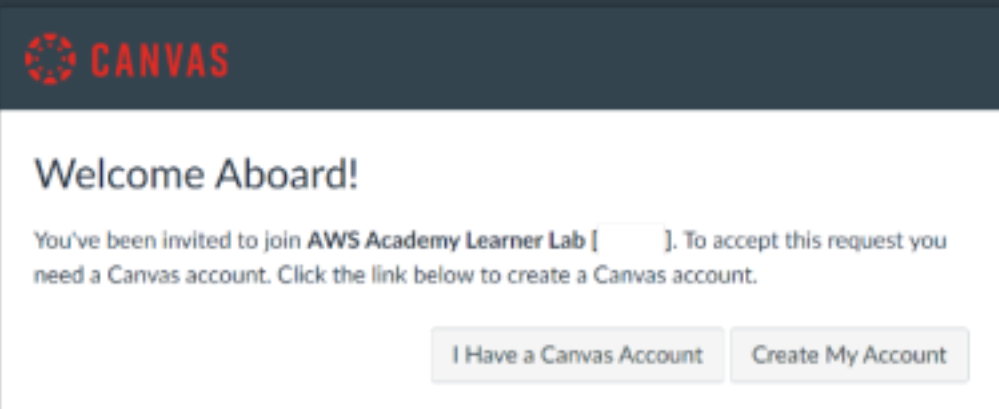
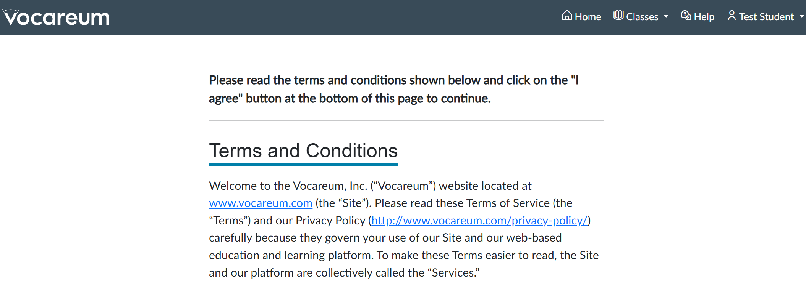
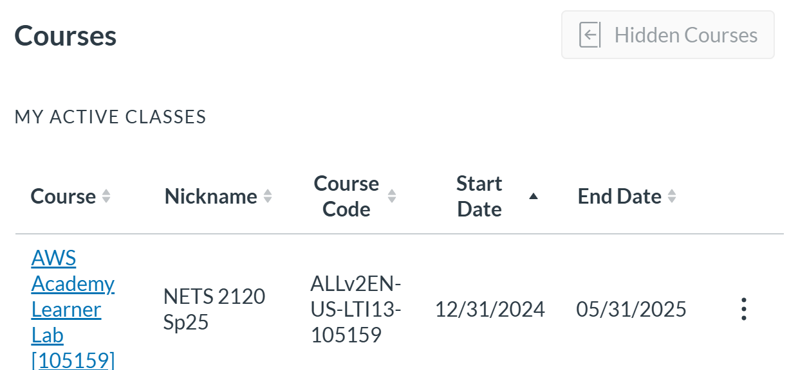
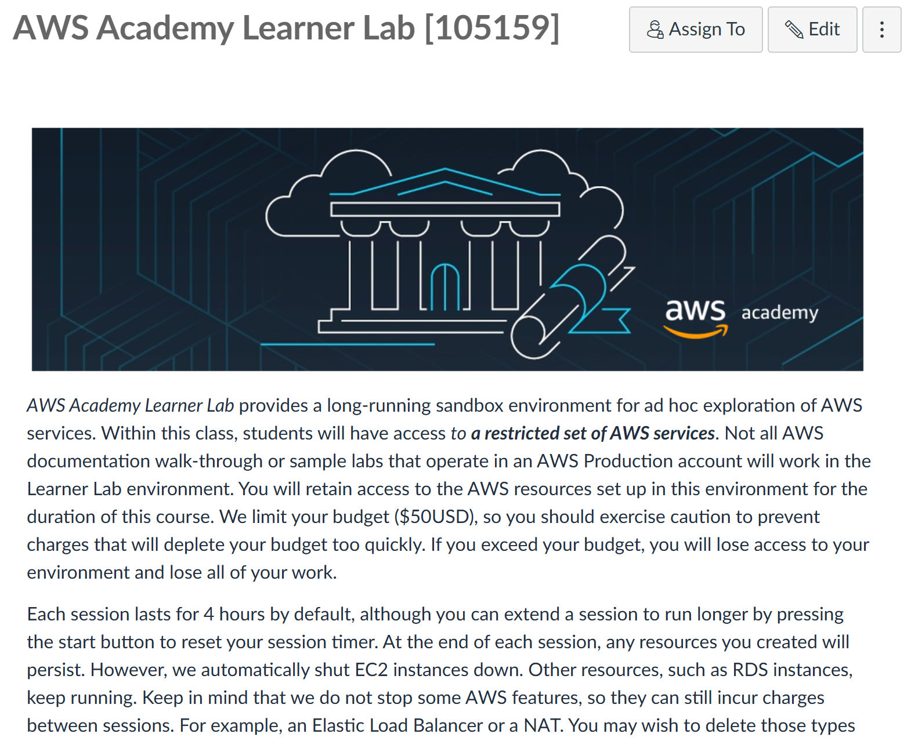
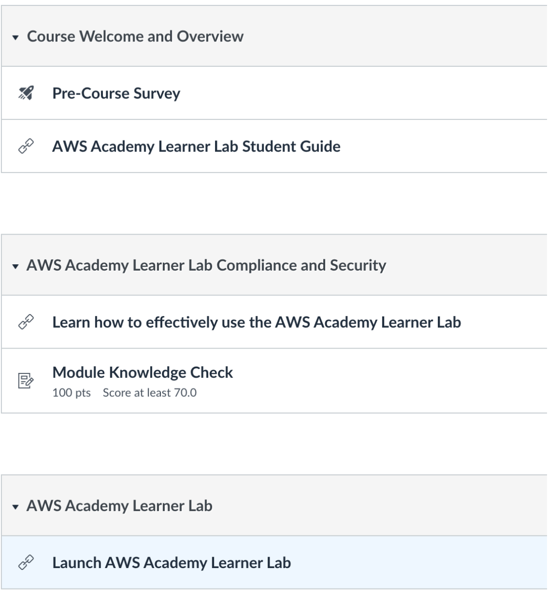
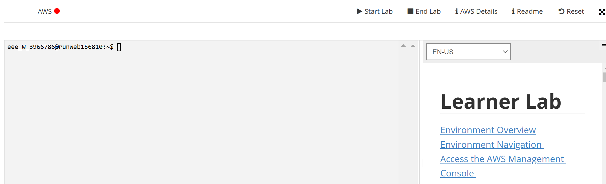
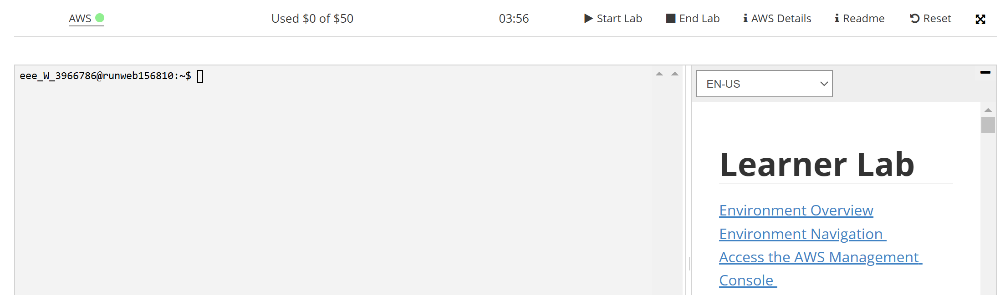
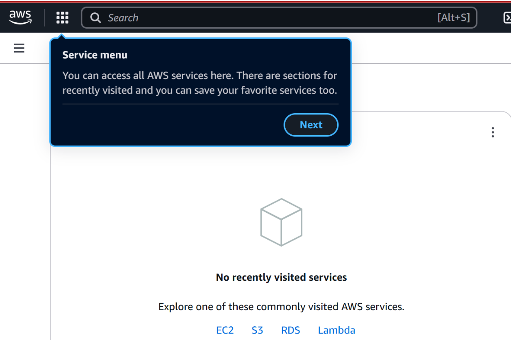

# Getting Started with Servers on AWS.

## Signing up for AWS Academy

Your access to Amazon Web Services will be handled through AWS Academy, which operates a Canvas site. This site will not be your course web site, but rather will be a separate site for a “Learning Lab” associated with your Penn course. Each AWS Academy Learning Lab gives you $50 in credits (per course per semester)! 

If you have received an invitation to join AWS Academy (check your spam folder!), you should click on it, then either select “I have a Canvas Account” (only use this if you have registered for AWS Academy for another course) or “Create My Account” (and set your password to register, your User ID is your email address).





Use your email address that received the invitation, and set a new password. Thereafter you should go to the login screen whenever you visit 
https://awsacademy.instructure.com/login/canvas:


## Finding Our Course's Lab

Now on the Dashboard, look for your “AWS Academy Learner Lab [105159]” course and click through:



which will give you the homepage for the Lab associated with NETS 2120.  **Please be aware this is a completely separate Canvas site, run by Amazon and Vocareum -- not by Penn.**  You should select the course and you'll see:



## Accessing the Cloud Lab

Now from the navigation menu, go to the **Modules** tab. 



You can read Amazon’s documentation in the Learner Lab - Student Guide. 

To actually do work: you’ll want to go to “Launch AWS Academy Learner Lab”. The first time, you’ll need to agree to Terms and Conditions. 


You’ll next want to click on “Start Lab” towards the top of the screen:



This will take a while, with the animated blue Vocareum “V” logo shown for a while. Eventually you’ll see something like this (note the green light, instead of a red or yellow one, next to the AWS link in the upper left): 



## Starting an EC2 Machine

Click on the “AWS” link with the green light. This will bring you to the **AWS Management Console**. Make sure you have selected **N. Virginia** (us-east-1) from the drop-down: 



Choose (or type in) EC2.

Click on "Launch instances":


Give the server a name like "NETS2120_Hw0" and choose Ubuntu 22.04 (LTS):


There may be some warnings from Amazon about permissions; you can ignore these.

For now we don't need much, so we'll choose `t3a.micro` as the Instance Type.

For "Key Pair", **Create a new key pair** and call it something like `nets2120_keypair`.


When you **Create key pair** this should download the `pem` file to your Downloads directory.

### Copy PEM File

Open your operating system's Terminal.

Mac OS:

```bash
cp ~/Downloads/nets2120_keypair.pem ~/.ssh
chmod 400 ~/.ssh/nets2120_keypair.pem
```

Windows:

```bash
copy %userprofile%\Downloads\nets2120_keypair.pem %userprofile%\.ssh
```

### Network Access

Next we need to put the server on the Internet, but block it against hackers.  You can set up the *firewall* to just let you use `ssh` from your machine:


Finally, click on **Launch instance** and wait a few minutes! You should see a green bar for "success," like this:


Click on the underlined machine name (`i-067d709d...` in the example).


### Web Access

Click on the Instance ID of the machine in the list.
Click on **Security**:


and then on the `sg-xxx` link. click on **Edit inbound rules**, and then click on **Add rule**. You should see something like:


Here, on the bottom row (which you are adding), click on the Source and change it to "My IP". Click on the Type, select "Custom TCP" and in the **Port range** enter your web server port `4567`.  Hit **Save rules**.


### Getting the Machine Name

Go back to "EC2" and "Instances" on the left sidebar.  Click on the Instance ID of your machine and you should see the details of your machine:


Copy the "Public IPv4 DNS" (you can click on the little rectangles under the heading).


## Logging in... from your Docker Container

To make things easy, we'll operate out of your Docker Container's Linux instance.

```bash
scp -i ~/.ssh/nets2120_keypair.pem id_ed25519 ubuntu@public-ipv4-dns:./.ssh
ssh -i ~/.ssh/nets2120_keypair.pem ubuntu@public-ipv4-dns
```

where `public-ipv4-dns` should be whatever you copied from the AWS console.

Type in `yes` when asked if you want to continue connecting.

Once you have the virtual machine running, we want to match the software configuration on your Docker container.  You can enter the following:

```bash
sudo apt-get update
sudo apt-get -y install wget curl openjdk-17-jdk maven tar unzip nginx npm nodejs
```

## Checking Out Your Code

Now you should be able to check out your code!  From your web browser interface, you can go to the GitHub project for the code, click on the green `<> Code` button, click on `SSH` and copy the link.

Then run `git clone` plus the pasted URL.  Your code should show up as `homework0-`*{myid}*.  Next `cd homework0/SimplestServer`.  Run `mvn compile` and then `mvn exec:java -Dexec.mainClass="nets2120.App"`.

Go to your web browser.  In the address bar, start with the prefix "http://".  Paste in the Public IP v4 DNS address.  Add ":4567" to select the web server port.

You should see `Hello user!` if all went well!

Go back to your remote terminal in VSCode.  Hit [Ctrl][C] to kill the server.  Type in:

```bash
cd ..
ip addr > address
git add address
git commit -m "Added AWS IP address"
git push
```

Note that after the `cd` command you should be in the parent directory of `SimplestServer`, i.e., your `homework0-`*myid* directory.  This should "push" your updated project back to GitHub.  Congratulations, you are now ready to submit!

## Shutting Down

You can type `exit` to shut down your terminal connected to EC2.  Then from the AWS EC2 Console, go to **Instance State** and **Terminate (delete)** the instance.  Finally, from the AWS Learner Lab, **Stop Laboratory**.


